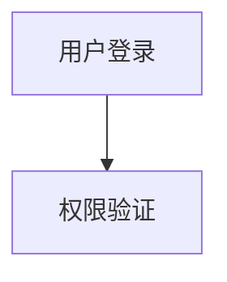

# Mermaid 流程图模板

> 模板版本：v2.0.1.1
> 最后更新：2026-03-23
> 图表类型：flowchart TD / LR / TB
> 引用位置：`templates.md` 第三节

---

## 一、标准注释头

```mermaid
%%{init: {
  'theme': 'base',
  'themeVariables': {
    'primaryColor': '[book.color]',
    'primaryTextColor': '#ffffff',
    'primaryBorderColor': '[book.color]',
    'lineColor': '[book.color]88',
    'secondaryColor': '[book.lightBg]',
    'tertiaryColor': '[book.accentBg]',
    'fontFamily': 'Source Han Sans SC, Microsoft YaHei, SimHei, sans-serif'
  }
}}%%
```

> **颜色注意**：将 `[book.color]` / `[book.lightBg]` / `[book.accentBg]` 替换为实际颜色值（可参考档案模板）

---

## 二、常用基础模板

### 2.1 线性流程（TB方向）

```mermaid
%%{init: { 'theme': 'base', 'themeVariables': { 'primaryColor': '[book.color]', 'primaryTextColor': '#ffffff', 'primaryBorderColor': '[book.color]', 'lineColor': '[book.color]88', 'fontFamily': 'Source Han Sans SC, Microsoft YaHei, SimHei, sans-serif' } }}%%
flowchart TB
  A["步骤一"] --> B["步骤二"]
  B --> C["步骤三"]
  C --> D["步骤四"]
```

### 2.2 带分支流程

```mermaid
%%{init: { 'theme': 'base', 'themeVariables': { 'primaryColor': '[book.color]', 'primaryTextColor': '#ffffff', 'primaryBorderColor': '[book.color]', 'lineColor': '[book.color]88', 'fontFamily': 'Source Han Sans SC, Microsoft YaHei, SimHei, sans-serif' } }}%%
flowchart TD
  A["开始"] --> B{条件判断}
  B -->|"是"| C["路径A"]
  B -->|"否"| D["路径B"]
  C --> E{"继续?"}
  D --> E
  E -->|"是"| F["下一步"]
  E -->|"否"| G["结束"]
```

---

## 三、使用指南

### 3.1 节点标签约定

| 约定 | 说明 |
|------|------|
| **字数限制** | 每节点不超过 15 个字 |
| 换行 | 标签内使用 `<br/>` 换行，如 `A["第一行<br/>第二行"]` |
| ID规范 | 英文ID + 中文标签，如 `A["用户注册入口"]` |
| 特殊字符 | 标签中的括号应用引号包裹，如 `A["结果(成功)"]` |

### 3.2 分支节点标注规范

**分支节点（菱形）标签应简洁，分支标签应清晰：**

```mermaid
%%{init: { 'theme': 'base', 'themeVariables': { 'primaryColor': '[book.color]', 'lineColor': '[book.color]88' } }}%%
flowchart TD
  A["检查项"] --> B{是否通过?}
  B -->|"通过<br/>预期结果"| C["继续执行"]
  B -->|"失败<br/>异常"| D["触发修复"]
```

### 3.3 图注约定

Mermaid 代码块后紧跟 HTML 注释作为图注：

```markdown

<!-- FIG: 3-1：用户登录流程图 -->
```

图注格式：`FIG: X-Y：说明`，X=章号，Y=图序号

### 3.4 选型原则

| 场景 | 推荐图表 |
|------|--------|
| 步骤/决策/流程 | 数据对比表格 |
| 3个以上节点平行 | 时间轴，用 timeline |
| 多重分支嵌套 | 状态结构关系，用 stateDiagram |

---

## 四、模板速查

```mermaid
%%{init: { 'theme': 'base', 'themeVariables': { 'primaryColor': '[book.color]', 'primaryTextColor': '#ffffff', 'primaryBorderColor': '[book.color]', 'lineColor': '[book.color]88', 'fontFamily': 'Source Han Sans SC, Microsoft YaHei, SimHei, sans-serif' } }}%%
flowchart TB
  A["输入"] --> B["处理"]
  B --> C{"判断"}
  C -->|"通过"| D["输出"]
  C -->|"拒绝"| E["回退"]
  D --> F["记录"]
  F --> G["完成"]
```
