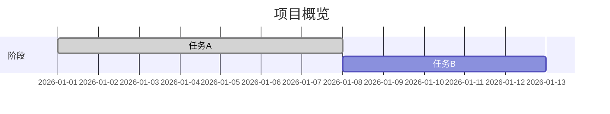

# Mermaid 甘特图模板

> 模板版本：v2.0.1.1
> 最后更新：2026-03-23
> 图表类型：gantt
> 引用位置：`templates.md` 第八节

---

## 一、标准注释头

```mermaid
%%{init: {
  'theme': 'base',
  'themeVariables': {
    'primaryColor': '[book.color]',
    'primaryTextColor': '#ffffff',
    'primaryBorderColor': '[book.color]',
    'lineColor': '[book.color]88',
    'secondaryColor': '[book.lightBg]',
    'tertiaryColor': '[book.accentBg]',
    'fontFamily': 'Source Han Sans SC, Microsoft YaHei, SimHei, sans-serif'
  }
}}%%
```

---

## 二、常用基础模板

### 2.1 简单甘特图

```mermaid
%%{init: { 'theme': 'base', 'themeVariables': { 'primaryColor': '[book.color]', 'primaryTextColor': '#ffffff', 'primaryBorderColor': '[book.color]', 'lineColor': '[book.color]88', 'fontFamily': 'Source Han Sans SC, Microsoft YaHei, SimHei, sans-serif' } }}%%
gantt
  title 任务安排
  dateFormat  YYYY-MM-DD

  section 任务组A
  任务1: done, 2026-01-01, 7d
  任务2: active, 2026-01-08, 5d
  任务3: 2026-01-13, 3d

  section 任务组B
  任务4: 2026-01-08, 6d
  任务5: 2026-01-14, 4d
```

### 2.2 多阶段规划

```mermaid
%%{init: { 'theme': 'base', 'themeVariables': { 'primaryColor': '[book.color]', 'primaryTextColor': '#ffffff', 'primaryBorderColor': '[book.color]', 'lineColor': '[book.color]88', 'fontFamily': 'Source Han Sans SC, Microsoft YaHei, SimHei, sans-serif' } }}%%
gantt
  title 项目计划
  dateFormat  YYYY-MM-DD

  section 阶段一
  规划: done, 2026-01-01, 5d
  里程碑: milestone, 2026-01-06

  section 阶段二
  开发: 2026-01-07, 15d
  测试: 2026-01-22, 5d

  section 阶段三
  发布: 2026-01-27, 3d
  里程碑: milestone, 2026-01-30
```

---

## 三、使用指南

### 3.1 任务语法

```
任务名: 状态, 开始时间, 持续时间
```

| 状态 | 说明 |
|------|------|
| `done` | 已完成 |
| `active` | 进行中 |
| `milestone` | 里程碑节点 |

### 3.2 时间格式

| 格式 | 示例 |
|------|------|
| 日期 | `2026-01-01` |
| 天数持续 | `7d`（天） |
| 周数持续 | `2w`（周） |

### 3.3 标签约定

| 约定 | 说明 |
|------|------|
| **字数限制** | 每任务名不超过 15 个字 |
| 分组 | 使用 `section` 分区组织 |

### 3.4 图注约定

```markdown

<!-- FIG: 8-1：项目甘特图 -->
```

### 3.5 选型原则

| 场景 | 推荐图表 |
|------|--------|
| 项目进度/周期 | 实时数据，用 table |
| 短周期内规划 | 状态结构，用 stateDiagram |
| 时间与资源关系 | 流程分解，用 flowchart |

---

## 四、模板速查

```mermaid
%%{init: { 'theme': 'base', 'themeVariables': { 'primaryColor': '[book.color]', 'primaryTextColor': '#ffffff', 'primaryBorderColor': '[book.color]', 'lineColor': '[book.color]88', 'fontFamily': 'Source Han Sans SC, Microsoft YaHei, SimHei, sans-serif' } }}%%
gantt
  title 计划总览
  dateFormat  YYYY-MM-DD
  section 执行
  任务A: done, 2026-01-01, 5d
  任务B: active, 2026-01-06, 3d
  任务C: 2026-01-09, 2d
```
