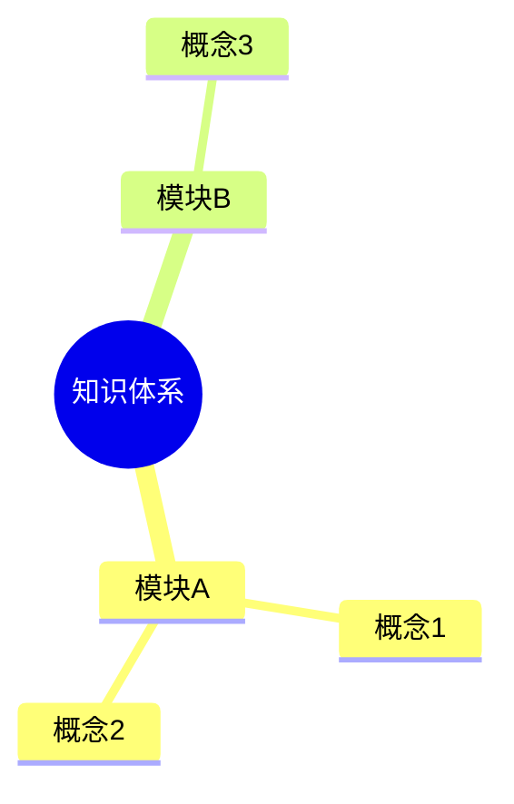

# Mermaid 思维导图模板

> 模板版本：v2.0.1.1
> 最后更新：2026-03-23
> 图表类型：mindmap
> 引用位置：`templates.md` 第六节

---

## 一、标准注释头

```mermaid
%%{init: {
  'theme': 'base',
  'themeVariables': {
    'primaryColor': '[book.color]',
    'primaryTextColor': '#ffffff',
    'primaryBorderColor': '[book.color]',
    'lineColor': '[book.color]88',
    'secondaryColor': '[book.lightBg]',
    'tertiaryColor': '[book.accentBg]',
    'fontFamily': 'Source Han Sans SC, Microsoft YaHei, SimHei, sans-serif'
  }
}}%%
```

---

## 二、常用基础模板

### 2.1 三层级思维导图

```mermaid
%%{init: { 'theme': 'base', 'themeVariables': { 'primaryColor': '[book.color]', 'primaryTextColor': '#ffffff', 'primaryBorderColor': '[book.color]', 'lineColor': '[book.color]88', 'fontFamily': 'Source Han Sans SC, Microsoft YaHei, SimHei, sans-serif' } }}%%
mindmap
  root((主题))
    主枝一
      子节点A
      子节点B
    主枝二
      子节点C
      子节点D
```

### 2.2 四层级扩展

```mermaid
%%{init: { 'theme': 'base', 'themeVariables': { 'primaryColor': '[book.color]', 'primaryTextColor': '#ffffff', 'primaryBorderColor': '[book.color]', 'lineColor': '[book.color]88', 'fontFamily': 'Source Han Sans SC, Microsoft YaHei, SimHei, sans-serif' } }}%%
mindmap
  root((书籍概念))
    维度一
      要点1.1
        细节A
        细节B
      要点1.2
    维度二
      要点2.1
      要点2.2
    维度三
      要点3.1
        细节C
```

---

## 三、使用指南

### 3.1 节点标签约定

| 约定 | 说明 |
|------|------|
| **字数限制** | 每节点不超过 15 个字 |
| 层级结构 | 建议不超过 4 层：根节点 → 主枝 → 子节点 → 细节 |
| 根节点 | 每个节点一行一个关键词 |

### 3.2 语法说明

- `root((主题))` - 根节点，使用双圆括号
- `主枝` - 一级分支，普通缩进
- `  子节点` - 二级分支，两格缩进
- `    细节` - 三级分支，四格缩进

### 3.3 图注约定

```markdown

<!-- FIG: 6-1：知识结构图 -->
```

### 3.4 选型原则

| 场景 | 推荐图表 |
|------|--------|
| 概念发散/归纳 | 线性流程，用 flowchart |
| 知识结构整理 | 时间轴序列，用 timeline |
| 头脑风暴整理 | 任务周期，用 gantt |

---

## 四、模板速查

```mermaid
%%{init: { 'theme': 'base', 'themeVariables': { 'primaryColor': '[book.color]', 'primaryTextColor': '#ffffff', 'primaryBorderColor': '[book.color]', 'lineColor': '[book.color]88', 'fontFamily': 'Source Han Sans SC, Microsoft YaHei, SimHei, sans-serif' } }}%%
mindmap
  root((主题))
    分支A
      要点1
      要点2
    分支B
      要点3
      要点4
```
