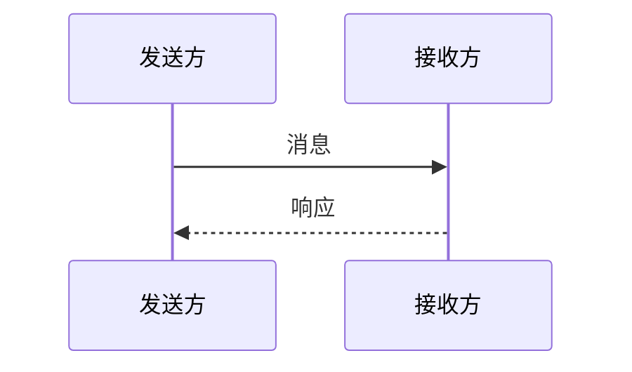

# Mermaid 时序图模板

> 模板版本：v2.0.1.1
> 最后更新：2026-03-23
> 图表类型：sequenceDiagram
> 引用位置：`templates.md` 第四节

---

## 一、标准注释头

```mermaid
%%{init: {
  'theme': 'base',
  'themeVariables': {
    'primaryColor': '[book.color]',
    'primaryTextColor': '#ffffff',
    'primaryBorderColor': '[book.color]',
    'lineColor': '[book.color]88',
    'secondaryColor': '[book.lightBg]',
    'tertiaryColor': '[book.accentBg]',
    'fontFamily': 'Source Han Sans SC, Microsoft YaHei, SimHei, sans-serif'
  }
}}%%
```

> **颜色注意**：将 `[book.color]` / `[book.lightBg]` / `[book.accentBg]` 替换为实际颜色值

---

## 二、常用基础模板

### 2.1 双角色交互

```mermaid
%%{init: { 'theme': 'base', 'themeVariables': { 'primaryColor': '[book.color]', 'lineColor': '[book.color]88', 'fontFamily': 'Source Han Sans SC, Microsoft YaHei, SimHei, sans-serif' } }}%%
sequenceDiagram
  participant A as 角色A
  participant B as 角色B

  A->>B: 发送请求
  B-->>A: 返回结果
```

### 2.2 多方交互

```mermaid
%%{init: { 'theme': 'base', 'themeVariables': { 'primaryColor': '[book.color]', 'lineColor': '[book.color]88', 'fontFamily': 'Source Han Sans SC, Microsoft YaHei, SimHei, sans-serif' } }}%%
sequenceDiagram
  participant U as 用户
  participant F as 前端
  participant B as 后端
  participant D as 数据库

  U->>F: 提交请求
  F->>B: API调用
  B->>D: 查询数据
  D-->>B: 返回结果
  B-->>F: API响应
  F-->>U: 展示结果
```

---

## 三、带条件与循环

```mermaid
%%{init: { 'theme': 'base', 'themeVariables': { 'primaryColor': '[book.color]', 'lineColor': '[book.color]88', 'fontFamily': 'Source Han Sans SC, Microsoft YaHei, SimHei, sans-serif' } }}%%
sequenceDiagram
  participant C as 客户端

  loop 循环重试
    C->>C: 发起请求
    C->>C: 验证响应
  end

  C-->>C: 循环结束
```

---

## 四、使用指南

### 4.1 箭头类型

| 类型 | 语法 | 含义 |
|------|------|------|
| 实线箭头 | `->>`  | 同步调用 |
| 虚线箭头 | `-->>`  | 响应返回 |
| 异步箭头 | `->`  | 异步通知 |
| 消失 | `x`  | 消息丢失 |

### 4.2 节点标签约定

| 约定 | 说明 |
|------|------|
| **字数限制** | 每节点不超过 15 个字 |
| 参与者命名 | 使用角色别名代替冗长系统名称 |

### 4.3 图注约定

```markdown

<!-- FIG: 4-1：双方时序交互图 -->
```

### 4.4 选型原则

| 场景 | 推荐图表 |
|------|--------|
| 角色/通信/多色块 | 状态图 |
| 请求-响应流程 | 线性流程，用 flowchart |
| 系统间时序 | 数据对比，用 table |

---

## 五、模板速查

```mermaid
%%{init: { 'theme': 'base', 'themeVariables': { 'primaryColor': '[book.color]', 'lineColor': '[book.color]88', 'fontFamily': 'Source Han Sans SC, Microsoft YaHei, SimHei, sans-serif' } }}%%
sequenceDiagram
  participant S as 发送方
  participant R as 接收方

  S->>R: 发送数据
  R-->>S: 确认接收
```
