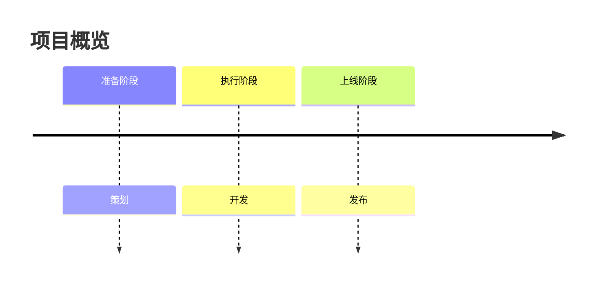

# Mermaid 时间轴模板

> 模板版本：v2.0.1.1
> 最后更新：2026-03-23
> 图表类型：timeline
> 引用位置：`templates.md` 第七节

---

## 一、标准注释头

```mermaid
%%{init: {
  'theme': 'base',
  'themeVariables': {
    'primaryColor': '[book.color]',
    'primaryTextColor': '#ffffff',
    'primaryBorderColor': '[book.color]',
    'lineColor': '[book.color]88',
    'secondaryColor': '[book.lightBg]',
    'tertiaryColor': '[book.accentBg]',
    'fontFamily': 'Source Han Sans SC, Microsoft YaHei, SimHei, sans-serif'
  }
}}%%
```

---

## 二、常用基础模板

### 2.1 简单时间轴

```mermaid
%%{init: { 'theme': 'base', 'themeVariables': { 'primaryColor': '[book.color]', 'primaryTextColor': '#ffffff', 'primaryBorderColor': '[book.color]', 'lineColor': '[book.color]88', 'fontFamily': 'Source Han Sans SC, Microsoft YaHei, SimHei, sans-serif' } }}%%
timeline
  title 时间演进
    阶段一: 事件A
    阶段二: 事件B
    阶段三: 事件C
```

### 2.2 详细时间轴

```mermaid
%%{init: { 'theme': 'base', 'themeVariables': { 'primaryColor': '[book.color]', 'primaryTextColor': '#ffffff', 'primaryBorderColor': '[book.color]', 'lineColor': '[book.color]88', 'fontFamily': 'Source Han Sans SC, Microsoft YaHei, SimHei, sans-serif' } }}%%
timeline
  title 项目阶段

    阶段一 准备
      需求分析
      资源调配
      评审通过

    阶段二 执行
      功能开发
      集成测试
      质量验证

    阶段三 收尾
      上线部署
      用户培训
      项目归档
```

---

## 三、使用指南

### 3.1 标签约定

| 约定 | 说明 |
|------|------|
| **字数限制** | 每节点不超过 15 个字 |
| 阶段标识 | 时间轴标题必须简洁 |
| 多事件写法 | 采用缩进多行结构 |

### 3.2 时间轴结构

```
阶段标题 描述文字
  子事件一
  子事件二
```

### 3.3 图注约定

```markdown

<!-- FIG: 7-1：项目实施时间轴 -->
```

### 3.4 选型原则

| 场景 | 推荐图表 |
|------|--------|
| 阶段时序 | 实时数据，用 table |
| 项目实施进度 | 状态结构，用 stateDiagram |
| 历史发展沿革 | 任务周期，用 gantt |

---

## 四、模板速查

```mermaid
%%{init: { 'theme': 'base', 'themeVariables': { 'primaryColor': '[book.color]', 'primaryTextColor': '#ffffff', 'primaryBorderColor': '[book.color]', 'lineColor': '[book.color]88', 'fontFamily': 'Source Han Sans SC, Microsoft YaHei, SimHei, sans-serif' } }}%%
timeline
  title 阶段概览
    阶段一: 事件A
    阶段二: 事件B
    阶段三: 事件C
```
